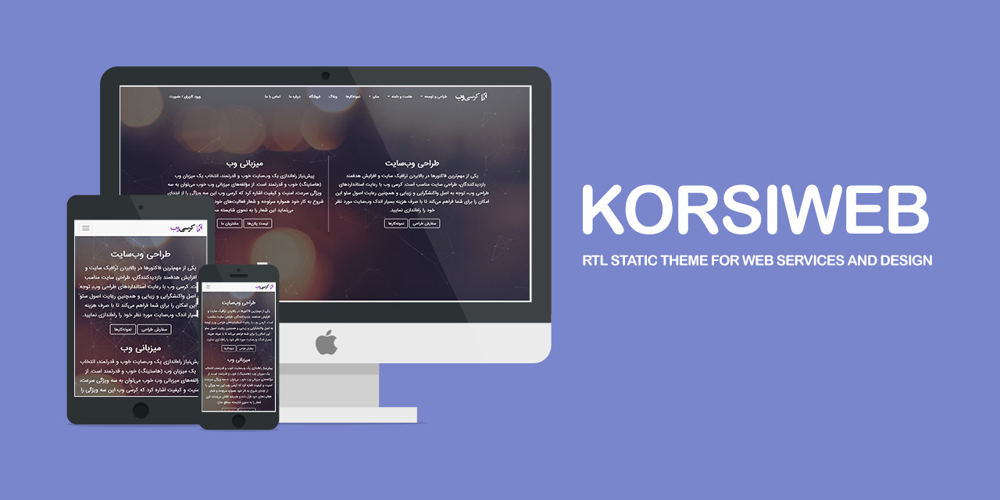

# KORSIWEB

RTL Static Theme For Web Services and Design

It's a single page theme created with Bootstrap 3. It's suitable for RTL websites specially those which release in Persian and Arabic languages.

## Demo
View the online [Demo](https://geraked.ir/portfolio/themes/korsiweb/).

## Author
**Rabist** - view on [LinkedIn](https://www.linkedin.com/in/rabist)

## License
Licensed under [MIT](LICENSE).